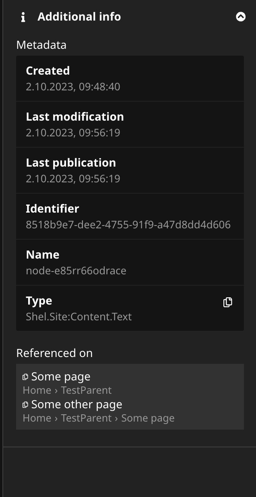

# See references to the selected node in the Neos CMS inspector

This package is not stable yet, handle with care.

After installing this plugin in Neos CMS you can view a list of references
to the selected node in the inspector sidebar.
The list is hidden by default in the `AdditionalInformation` group.
When uncollapsing the group the reference list is fetched from the server
and displayed.

You can click on each item to be directed to the page that contains the reference.

This helps finding out where a content element is being used.

## Configuration
            
You can adjust the `nodeTypeFilter` to include more reference nodetypes
than the one provided by `Neos.NodeTypes`.
Multiple types can be comma separated or excluded with a `!`.

    Shel:
        ReferenceList:
            nodeTypeFilter: 'Neos.NodeTypes.ContentReferences:ContentReferences'
